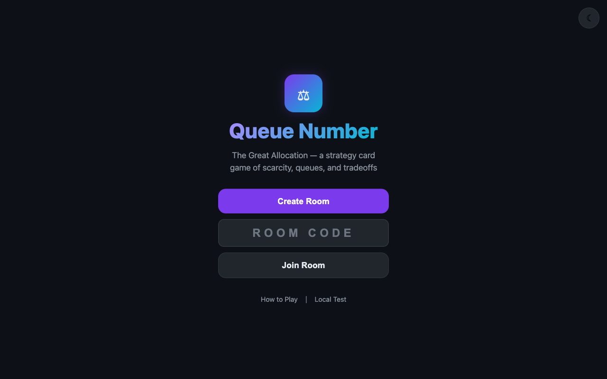
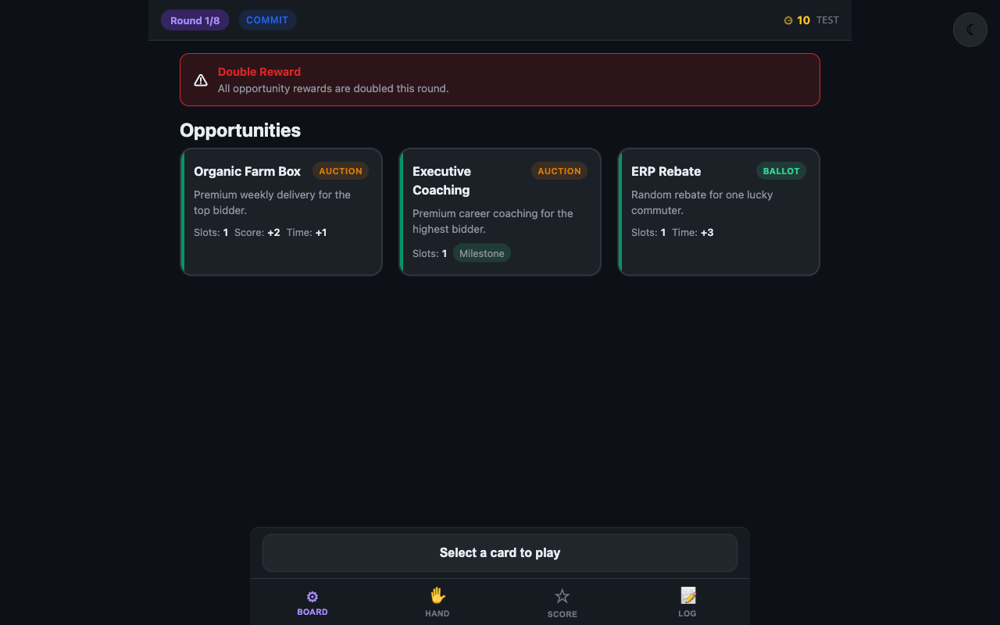

<div align="center">

# Queue Number: The Great Allocation

[](https://developer.mozilla.org/en-US/docs/Web/HTML)
[](https://developer.mozilla.org/en-US/docs/Web/CSS)
[](https://developer.mozilla.org/en-US/docs/Web/JavaScript)
[](https://firebase.google.com/)
[](https://alfredang.github.io/cardgame/)
[](LICENSE)

**A mobile-first multiplayer strategy card game about navigating scarcity, queue systems, and time allocation.**

[Live Demo](https://alfredang.github.io/cardgame/) · [How to Play](https://alfredang.github.io/cardgame/instructions.html) · [Report Bug](https://github.com/alfredang/cardgame/issues) · [Request Feature](https://github.com/alfredang/cardgame/issues)

</div>

## Screenshot





## About

Queue Number: The Great Allocation is a browser-based multiplayer card game where 2-5 players compete to secure limited opportunities by playing queue cards, bidding time tokens, and entering ballot draws. Inspired by real-world queue culture, timed releases, and allocation tradeoffs.

### Key Features

| Feature | Description |
|---------|-------------|
| **Mobile-First** | Designed for phones with large tap targets, bottom nav, card carousel |
| **QR Code Join** | Host creates room, others scan QR to join instantly on mobile |
| **Real-Time Multiplayer** | Firebase-powered synchronization for 2-5 players |
| **Hidden Commitments** | Players secretly select cards and targets, then reveal simultaneously |
| **3 Resolution Types** | Priority (lowest queue #), Auction (highest bid), Ballot (weighted random) |
| **120+ Cards** | 40 Opportunities, 35 Queue, 25 Milestones, 20 Disruptions |
| **Dark/Light Theme** | Elegant dark mode default with persistent theme toggle |
| **Local Test Mode** | Try the full UI without Firebase setup |
| **Reconnection** | Auto-reconnects if you refresh or lose connection mid-game |

## Tech Stack

| Layer | Technology |
|-------|-----------|
| Frontend | HTML5, CSS3, Vanilla JavaScript |
| Real-Time Sync | Firebase Realtime Database |
| QR Code | qrcodejs (CDN) |
| Hosting | GitHub Pages |
| Design | Mobile-first, CSS Custom Properties, Scroll-Snap |

## Architecture

```
┌─────────────────────────────────────────────────┐
│                   Browser (Client)               │
├──────────┬──────────┬──────────┬────────────────┤
│ index.html│ style.css│  qr.js  │instructions.html│
├──────────┴──────────┴──────────┴────────────────┤
│                    app.js                        │
│  Screen Management · Room Flow · Lobby · Nav     │
├──────────────────────────────────────────────────┤
│                    game.js                       │
│  Card Data · GameEngine · Resolution · Scoring   │
├──────────────────────────────────────────────────┤
│               firebase-config.js                 │
│  Firebase SDK · DB Helpers · Presence Tracking   │
└──────────────────┬───────────────────────────────┘
                   │ Real-Time Sync
┌──────────────────▼───────────────────────────────┐
│           Firebase Realtime Database              │
│  rooms/{code}/meta · players · gameState · hands  │
│  submissions (hidden) · decks · scores · log      │
└──────────────────────────────────────────────────┘
```

## Project Structure

```
cardgame/
├── index.html            # Main SPA (landing, lobby, game, game over screens)
├── instructions.html     # Full How to Play guide (12 sections)
├── style.css             # Mobile-first CSS with dark/light themes
├── app.js                # Room management, lobby, game wiring, UI events
├── game.js               # Card data (120+), game engine, resolution, scoring
├── firebase-config.js    # Firebase initialization and database helpers
├── qr.js                 # QR code generation, clipboard, share, toasts
├── screenshot.png         # Landing page screenshot
├── screenshot-game.png    # Game board screenshot
└── .github/
    └── workflows/
        └── deploy-pages.yml  # GitHub Pages auto-deployment
```

## Getting Started

### Prerequisites

- A modern web browser (Chrome, Safari, Firefox, Edge)
- A [Firebase](https://firebase.google.com/) project (free tier works)

### Installation

1. **Clone the repo**
   ```bash
   git clone https://github.com/alfredang/cardgame.git
   cd cardgame
   ```

2. **Configure Firebase** (see [Firebase Setup](#firebase-setup) below)

3. **Serve locally**
   ```bash
   # Any static server works:
   python3 -m http.server 8080
   # or
   npx serve .
   ```

4. **Open in browser**
   ```
   http://localhost:8080
   ```

5. **Try without Firebase** — Click "Local Test" on the landing page to explore the full UI with mock data.

### Firebase Setup

1. Go to [Firebase Console](https://console.firebase.google.com/) and click **Add project**
2. Enter a project name (e.g., `queue-number-game`) and click **Continue**
3. Disable Google Analytics (optional) and click **Create project**
4. Once created, click the **Web** icon (`</>`) to add a web app
5. Register the app with a nickname and click **Register app**
6. Copy the `firebaseConfig` object from the setup screen
7. Open `firebase-config.js` and replace the placeholder values:
   ```javascript
   const firebaseConfig = {
     apiKey:            "YOUR_ACTUAL_API_KEY",
     authDomain:        "your-project.firebaseapp.com",
     databaseURL:       "https://your-project-default-rtdb.firebaseio.com",
     projectId:         "your-project-id",
     storageBucket:     "your-project.appspot.com",
     messagingSenderId: "123456789",
     appId:             "1:123456789:web:abcdef"
   };
   ```
8. In the Firebase Console sidebar, go to **Build > Realtime Database**
9. Click **Create Database**, choose a location, and select **Start in test mode**
10. Your game is now connected! Create a room and share the QR code to play.

> **Note:** Test mode rules expire after 30 days. For production, configure proper [security rules](https://firebase.google.com/docs/database/security).

## How to Play

1. **Create a Room** — One player taps "Create Room" and shares the QR code or room code
2. **Join** — Other players scan the QR or enter the 4-letter code on their phones
3. **Choose Milestone** — Each player picks 1 of 2 milestone cards to guide their strategy
4. **Play Rounds** — Each round: see opportunities, secretly commit a queue card + target, then resolve
5. **Win Opportunities** — Priority (lowest #), Auction (highest bid), or Ballot (random draw)
6. **Score Points** — From opportunity rewards, milestone bonuses, set bonuses, and diversity bonuses
7. **Final Score** — After 7-8 rounds, highest total score wins (tiebreaker: most Time remaining)

Full rules: [How to Play](https://alfredang.github.io/cardgame/instructions.html)

## Deployment

The project auto-deploys to GitHub Pages on every push to `main` via GitHub Actions.

To deploy your own fork:
1. Fork this repository
2. Enable GitHub Pages in Settings > Pages > Source: GitHub Actions
3. Push to `main` — the workflow deploys automatically
4. Your site will be live at `https://<your-username>.github.io/cardgame/`

## Contributing

Contributions are welcome!

1. Fork the repository
2. Create a feature branch (`git checkout -b feature/amazing-feature`)
3. Commit your changes (`git commit -m 'Add amazing feature'`)
4. Push to the branch (`git push origin feature/amazing-feature`)
5. Open a Pull Request

## Developed By

Powered by **[Tertiary Infotech Academy Pte Ltd](https://www.tertiarycourses.com.sg/)**

## Acknowledgements

- [Firebase](https://firebase.google.com/) — Real-time database and hosting
- [qrcodejs](https://github.com/davidshimjs/qrcodejs) — QR code generation
- [Claude Code](https://claude.ai/code) — AI-assisted development

---

<div align="center">

**If you found this project useful, please give it a star!**

</div>
